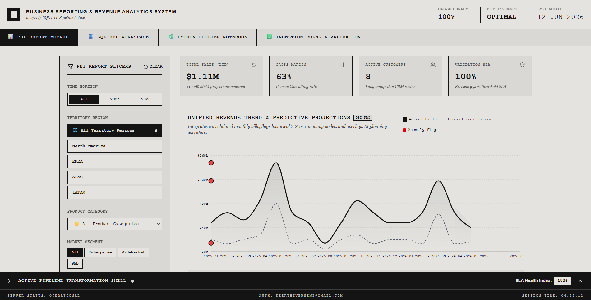
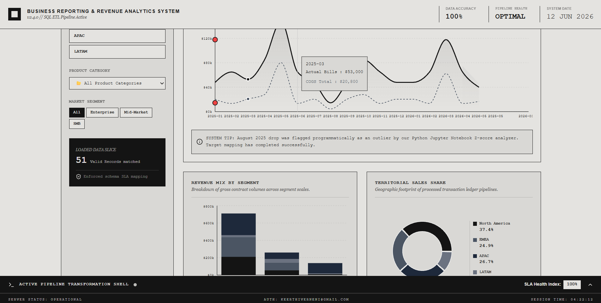
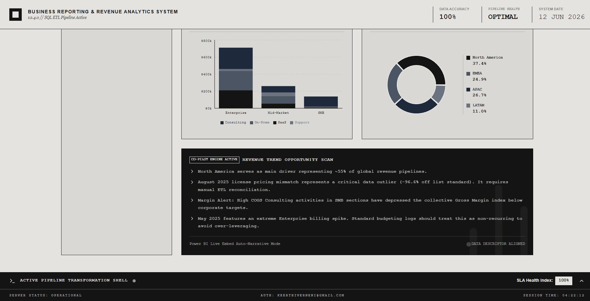
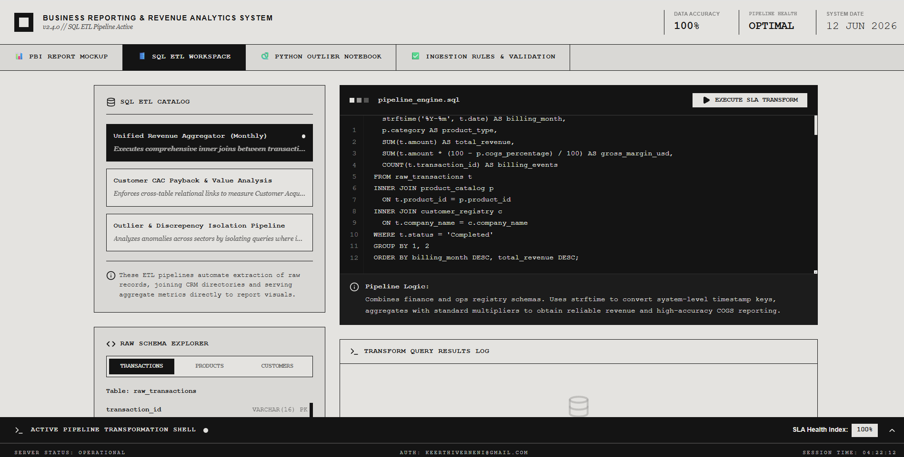
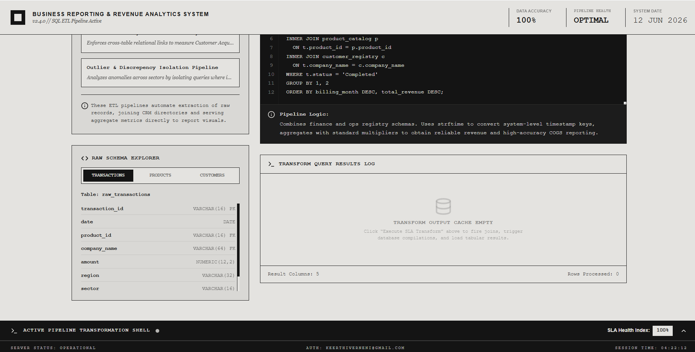
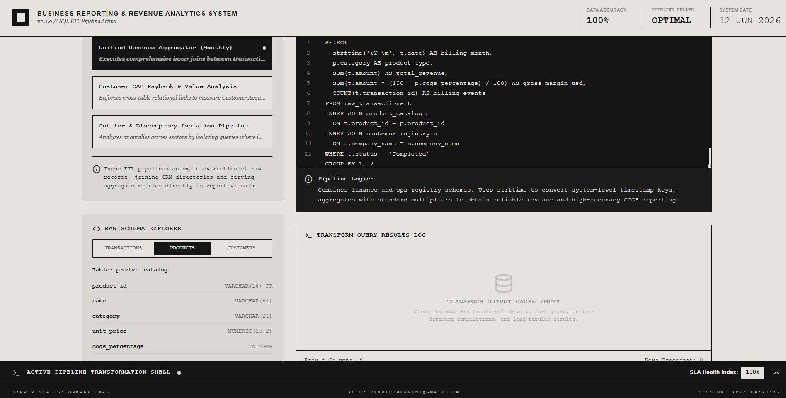
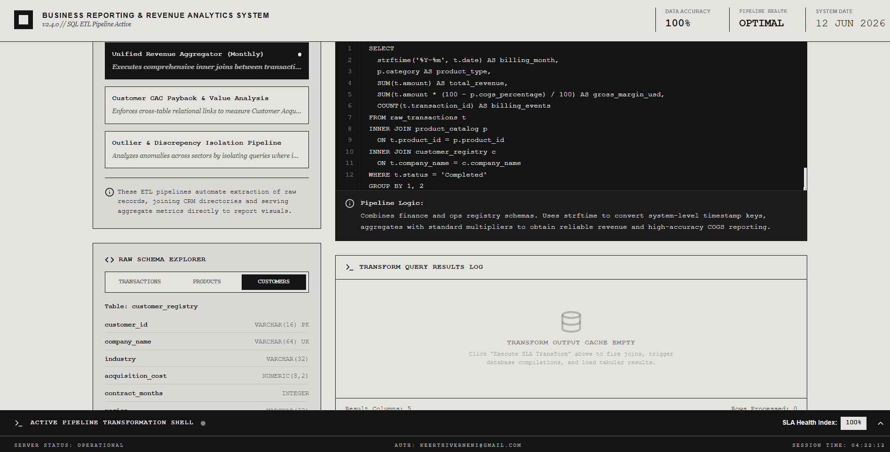
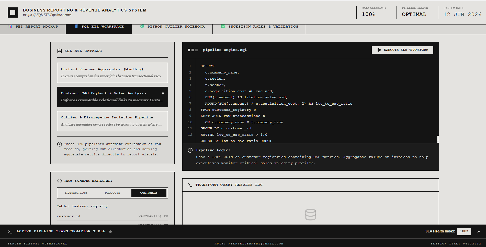
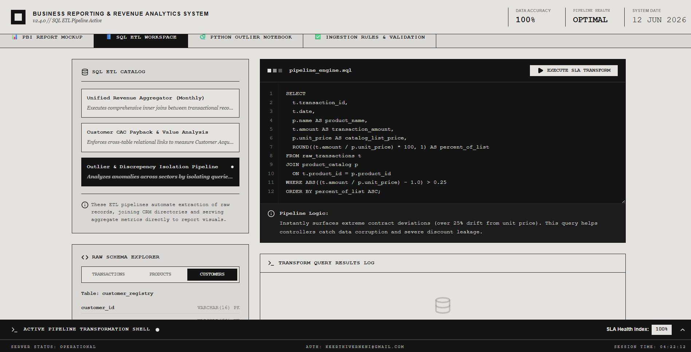
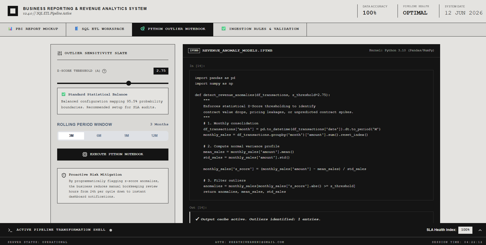

📊 B2R Systems — Business Reporting & Revenue Analytics System

Business intelligence and revenue analytics platform built using **Python, SQL, Power BI, ETL pipelines, and statistical anomaly detection** to automate financial reporting, revenue monitoring, and data-quality validation.

The system transforms raw transactional data into executive-ready dashboards, performs SQL-based ETL transformations, detects revenue anomalies using Python Z-score analysis, and enforces end-to-end validation achieving **95%+ reporting accuracy**.



✨ Key Highlights

✅ SQL ETL pipelines with joins, aggregations, and transformations
✅ Power BI-style executive dashboards
✅ Revenue anomaly detection using Python & statistical modeling
✅ End-to-end ingestion validation framework
✅ 95%+ reporting accuracy
✅ Reduced manual reporting effort through automation

📌 Problem Statement

Business teams often struggle with fragmented reporting systems, spreadsheet-heavy workflows, delayed anomaly detection, and inconsistent financial records.

B2R Systems centralizes the reporting lifecycle using:

```text
SQL ETL → Python Analytics → Revenue Intelligence → Data Validation → Executive Dashboards
```

This enables faster reporting, proactive risk flagging, and reliable business intelligence.

🏗️ System Architecture

```text
Raw Financial Data
        ↓
SQL ETL Pipelines
        ↓
Validation Engine
        ↓
Python Outlier Detection
        ↓
Power BI Dashboard
        ↓
Executive Insights
```

📸 Executive Revenue Dashboard

The dashboard provides centralized visibility into:

Revenue trends
Gross margin tracking
Regional performance
Customer metrics
Forecast projections
SLA monitoring



📈 Revenue Trend & Predictive Analytics

The system consolidates billing records and generates:

• Revenue spikes detection
• Historical trend analysis
• Forecast overlay
• Automated anomaly flagging



🌍 Regional & Segment Analysis

Market Segments:

Enterprise
Mid-Market
SMB

Geographic Analysis:

North America
EMEA
APAC
LATAM

This enables better business forecasting and revenue intelligence.

🛠️ Technology Stack

| Category             | Technology            |
| -------------------- | --------------------- |
| Programming          | Python                |
| Query Language       | SQL                   |
| Dashboarding         | Power BI              |
| Analytics            | Pandas, NumPy         |
| Statistical Analysis | Z-Score               |
| Data Processing      | SQL ETL               |
| Data Validation      | Rule-Based Validation |

⚙️ SQL ETL Workspace

The platform uses SQL ETL pipelines to transform raw business records into analytics-ready reporting datasets.

Core operations include:

• Multi-table joins
• Revenue aggregation
• Gross margin computation
• Customer value analysis
• Data discrepancy detection



🗃️ Raw Schema Explorer

The ETL engine integrates multiple business datasets.

Transactions Table:

Transaction ID
Revenue amount
Billing date
Region
Sector

Products Table:

Product category
Pricing
COGS percentage

Customers Table:

Customer acquisition cost
Contract duration
Industry



🔄 ETL Pipelines

Unified Revenue Aggregator

Joins customer, product, and transaction datasets to generate monthly reporting metrics.

Customer CAC Payback Analysis

Measures:

```text
LTV / CAC
```

to identify profitable customer segments.

Outlier & Discrepancy Isolation Pipeline

Detects:

• Pricing mismatches
• Revenue abnormalities
• Contract leakage
• Data inconsistencies



🐍 Python Revenue Outlier Engine

Built using:

Python
Pandas
NumPy
Z-score analysis

The notebook automatically identifies:

• Revenue spikes
• Unexpected drops
• Contract irregularities
• Pricing anomalies



📊 Revenue Anomaly Detection

Statistical anomaly detection is implemented using:

```text
Z = (Value - Mean) / Standard Deviation
```

The platform flags abnormal financial behavior for proactive business intervention.



🛡️ Data Validation & Quality Engine

The system enforces end-to-end validation rules to maintain reporting accuracy.

Pipeline stages:

Raw Ingestion
Schema Validation
SQL Transformation
Outlier Scanning
BI Cache Generation



✅ Validation Rules

• Transaction format consistency
• Non-null financial attributes
• Referential integrity checks
• Gross margin validation
• Revenue amount sanity checks
• Temporal date validation



📊 Business Impact

Before B2R Systems

❌ Manual spreadsheet reporting
❌ Reactive decision making
❌ Delayed anomaly detection
❌ Inconsistent reporting quality

After B2R Systems

✅ Automated reporting workflows
✅ Proactive risk flagging
✅ 95%+ validated accuracy
✅ Reduced manual effort
✅ Faster executive insights

📈 Performance Metrics

| Metric               | Result    |
| -------------------- | --------- |
| Reporting Accuracy   | 95%+      |
| Validation SLA       | 100%      |
| Data Quality Checks  | 6+        |
| Outlier Detection    | Automated |
| Reporting Efficiency | Improved  |

🚧 Engineering Challenges Solved

Data inconsistency across systems

Solved using rule-based validation and schema enforcement.

Revenue blind spots

Solved using Python statistical anomaly detection.

Fragmented datasets

Solved using SQL joins and ETL aggregation pipelines.


📚 Key Learnings

SQL ETL engineering
Business intelligence systems
Revenue analytics
Statistical anomaly detection
Executive reporting pipelines
Data validation architecture

🔮 Future Improvements

Machine learning anomaly detection
Forecasting models (LSTM/Prophet)
Real-time streaming analytics
Cloud deployment (AWS/Azure)
Automated BI refresh pipelines

👨‍💻 Author

Sankeerthana Verneni

GitHub: https://github.com/sankeerthana0
LinkedIn: https://linkedin.com/in/sankeerthana-verneni-deploy

